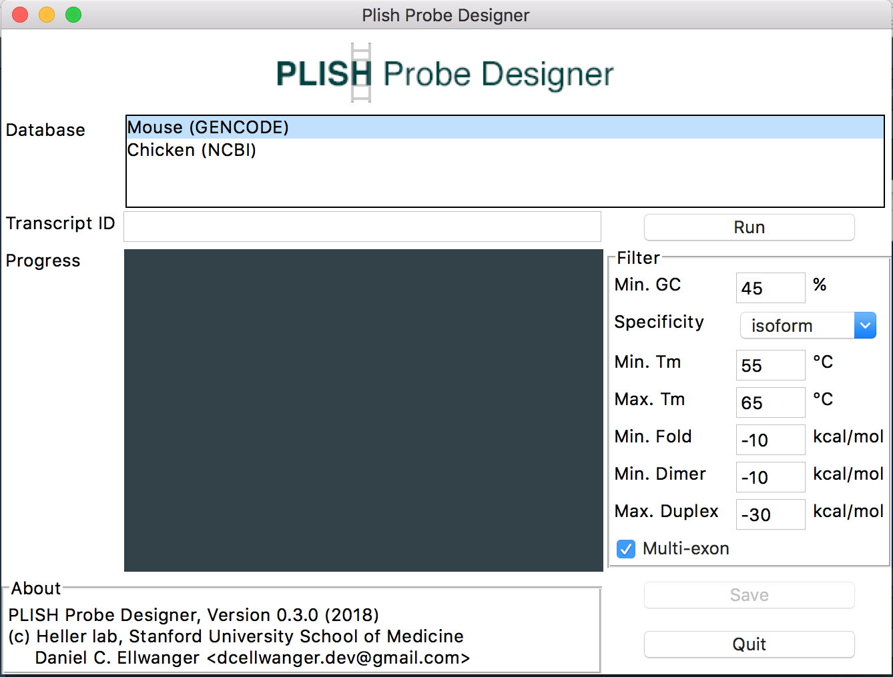

``` {r}
Version 0.3.1
(c) Daniel C. Ellwanger, 2018.
```
## About
  **PLISH Probe Designer** facilitates the selection of hybridization probes for the proximity ligation _in situ_ hybridization (PLISH) technology recently pulbished by the Harbury and Desai labs at Stanford University (_Elife_ 2018 Jan 10;7. pii: e30510. doi: [10.7554/eLife.30510](https://doi.org/10.7554/eLife.30510)). PLISH enables rapid and scalable single-cell spatial-profiling of genes of interest using multiplexed hybridization and signal amplification of target RNA species in a single parallel reaction, and the RNAs are then localized within the target tissue with rapid label-image-erase cycles. Therefore, it is a promising technology to inform and validate data analyses from single-cell RNA-Seq experiments.

  **PLISH Probe Designer** facilitates the selection and design of proper hybridization probes (H-probes) for PLISH. For each candidate probe of a given target transcript, **PLISH Probe Designer** computes a set of features (e.g., melting temperature, probe specificity and fold), which allows the user to select optimal H-probe sequences. Further, for selected probe sequences, **PLISH Probe Designer** generates the ready-to-order H-probe sequences containing the required connector circle and common bridge sequences for a set of fluorphores (A488, Cy3, Texas Red, Cy5, and PB405).

This tool has been developed and tested using Unix (macOS Sierra).

## Installation
### macOS
Simply [download](https://github.com/dcellwanger/PLISH-ProbeDesigner/archive/master.zip) this repository and unpack it. To compute some candidate probe features, **PLISH Probe Designer** makes use of two external software packages: `BLAST+` (Camacho *et al*., *BMC Bioinformatics* 2009) and `RNAstructure` (Reuter and Mathews, *BMC Bioinformatics* 2010). Please, download both software archives from [here](https://drive.google.com/open?id=10Z4G1dudj6HDbeqwgTbA40H90Uwrxnra) and unpack them into the `tools` folder of **PLISH Probe Designer**.

## Database Creation
To create a transcript database, **PLISH Probe Designer** requires a `gff3` annotation and a matching `fasta` genome sequence file - the same file types that are commonly used to map RNA-Seq reads. Those files can be obtained from common genome databases, such as [ENSEMBL](https://uswest.ensembl.org/info/data/ftp/index.html), [NCBI](https://www.ncbi.nlm.nih.gov/genome/doc/ftpfaq/), and [GENCODE](https://www.gencodegenes.org/releases/current.html). For consistency reasons, we recommend to use those files that were basis for read alignment and quantification in your single-cell RNA-Seq experiment.

The script `createDatabase.py` (located in the **PLISH Probe Designer** directory) allows a convenient creation of a database. Within an active Terminal session, the usage of the script can be shown by:

```
python createDatabase.py --help
```

```
### usage: createDatabase.py [-h] -gff FILEPATH -fna FILEPATH -db ID -name NAME
###                          [-comment COMMENT]
###
### optional arguments:
###  -h, --help        show this help message and exit
###  -gff FILEPATH     annotation GFF file
###  -fna FILEPATH     genome sequence FASTA file
###  -db ID            identifier of database (e.g., mmu_refseq); please, avoid
###                    white-spaces and special characters.
###  -name NAME        name of database
###  -comment COMMENT  any comments to add to the info file (e.g., genome
###                    assembly)
```

## Database Deletion
A database can simply be deleted by removing the respective subfolder in `database` of the **PLISH Probe Designer** directory.

## Probe Selection
After successful installation, **PLISH Probe Designer** can be simply started from within an active Terminal: 

```
python probeDesigner.py
```


### Feature Calculation
The first step is to identify all candidate probe sequences and calculate the features. The only information that is needed, is the database and the identifier of the target transcript - its sequence is loaded automatically. After providing this input, hit `Run`. The status of the computation will be shown in the `Progress` panel. **PLISH Probe Designer** automatically runs several thermodynamic analyses (free energy of the canidate probe fold, free energy of the homodimer, and free energy of the duplex with the target region) and a BLAST search against a local organism-specific database to assess probe specificity. Please note that these two steps are quite compute-intensive and therefore, depending on the number of candidates may take some time (~1 minute).

### Filter and Export
Next, set the desired parameters to filter proper hybridization probes:

* Minimum GC content
* Minimum probe specificity: isoform-specific (only BLAST hits on the target transcript), gene-specific (BLAST hits also on splice variants of the target gene), non-specific (no BLAST hit with an e-value < 10 or BLAST hits also on transcripts of other genes)
* The desired melting temperature (Tm) range
* The minimum free energy of the RNA fold [the higher the better; a value of 0 kcal/mol denotes no secondary structure]
* The minimum free energy of the homodimer [the higher the better; a value of 0 kcal/mol denotes no homodimerization]
* The maximum free energy of the duplex with the target sequence [the lower the stronger the binding to its target]
* If the probe should span an exon junction site of the target transcript

Then hit the `Save` button. Two files are written into the `results` folder: a `csv` file containing all computed features for each probe [can be opened with any Text editor or imported to a Spreadsheet Software, such as MS Excel], and a `fna` FASTA file [can be opened with any Text editor] containing the ready-to-order H-probe sequences for a set of fluorphores (2X = A488, 3X = Cy3, 4X = Texas Red, 5X = Cy5, and 6X = PB405).

**Please note** that the number of selected probes can be easily lowered or increased: just adjust the filter parameters and hit `Save` again. It is *not* required to re-run the whole feature calculation.

The resulting `csv` file contains the following columns:

* `Hprobe: Id`: The identifier of the H-probe composed of 'gene name-transcript id-index'
* `Hprobe: Target sequence`: The target sequence
* `Hprobe: %GC`: The GC content of the target sequence
* `Hprobe: Multipe exons?`: Indicates if the target region spans multiple exons
* `Hprobe: Exons`: The exons that are spanned by the H-probe
* `Hprobe: Specificity`: The specificity of the H-probe
* `Hprobe: Blast Hits (Ident%)`: The BLAST hits

For the `Left` and `Right` arm of the probe:

* `Seq`: The sequence of the H-probe arm
*  `Tm`: The melting temperature of the H-probe arm (according to Nakano _et. al._, _PNAS_ 1999)
*  `Bimol.`: Folding free energy change of homodimerization of the H-probe arm
*  `Unimol.`: Folding free energy change of the self-structure of the H-probe arm
*  `Duplex`: Folding free energy change for the duplex formation of the H-probe arm with the target sequence
*  `Open5`: Energy cost of opening the two base pairs at the 5'-end of the H-probe arm in a duplex with the complementary sequence
*  `Open3`: Energy cost of opening the two base pairs at the 3'-end of the H-probe arm in a duplex with the complementary sequence

## Example
In this example, we generate H-probes for the gene *TECTA* as annotated in the chicken genome (Gallus gallus) by [NCBI Genome](https://www.ncbi.nlm.nih.gov/genome/?term=gallus%20gallus).

### Database Creation
First, we need to download and unpack the [gff3](https://bit.ly/2JLlkEw) and [fasta](https://bit.ly/2LzXw8e) files. In this example, the files are named `GCF_000002315.5_GRCg6a_genomic.gff` and `GCF_000002315.5_GRCg6a_genomic.fna` and are, for example, located in the folder `/Users/dcellwanger/Downloads/`.

Then, the database is created within a Terminal by:

```
python createDatabase.py \
-gff /Users/dcellwanger/Downloads/GCF_000002315.5_GRCg6a_genomic.gff \
-fna /Users/dcellwanger/Downloads/GCF_000002315.5_GRCg6a_genomic.fna \
-db ncbi_gga -name 'Chicken (NCBI)' \
-comment 'Gallus gallus assembly GRCg6a'
```

```
### Writing info file...
### Extracting exon info...
### Processed 500000 lines ...
### Processed 1000000 lines ...
### Processed 1500000 lines ...
### Calculating exon lengths ...
### Writing exon file ...
### Writing sequence file ...
### Generating BLAST+ database ...
### 
### 
### Building a new DB, current time: 07/19/2018 23:54:43
### New DB name:   /Users/dcellwanger/PLISH-ProbeDesigner/database/ncbi_gga/ncbi_gga
### New DB title:  /Users/dcellwanger/PLISH-ProbeDesigner/database/ncbi_gga/ncbi_gga.fna
### Sequence type: Nucleotide
### Keep MBits: T
### Maximum file size: 1000000000B
### Adding sequences from FASTA; added 62160 sequences in 3.70513 seconds.
### Generation of database "ncbi_gga" is finished.
```

### Probe Selection
Let's start the **PLISH Probe Designer** (`python probeDesigner.py`), select the database 'Chicken (NCBI)' and the *TECTA* transcript NM_204873. Hit the `Run` button. 

```
### Target: NM_204873 ("TECTA")
### #Candidates: 548
### Step 1/4: Analyzing splice junction sites...
### Step 2/4: Calculating melting temperature...
### Step 3/4: Calculating thermodynamics...
### Step 4/4: Assessing specificity...
### ------------------[ DONE ]------------------
```

Then, `Save` the probes using the standard filter settings. This generates the files `TECTA-NM_204873_hprobe.csv` and `TECTA-NM_204873_hprobe.fna` for 4 selected probes in the results directory. In the latter file, for example, we can then extract the sequences for the H-probe detectable by PB405 (X6):

```
>HL6X-TECTA-NM_204873-5813
TAGGTCAGGAAACTTACGTCGTTATGTCCACACCGTGTTCTTGTAT
>HR6X-TECTA-NM_204873-5813
ACGATGTGAGTGCTGTTGGATTATACGTCGAGTTGAATAGCCAGGTT

>HL6X-TECTA-NM_204873-5956
TAGGTCAGGAAACTTACGTCGTTATGCACTGTCAGGTTGATCACAC
>HR6X-TECTA-NM_204873-5956
TGAGCATTGGCCGCACGACTTTATACGTCGAGTTGAATAGCCAGGTT

>HL6X-TECTA-NM_204873-6187
TAGGTCAGGAAACTTACGTCGTTATGCCCTCCCTCAATGATGAAGT
>HR6X-TECTA-NM_204873-6187
AGCGTAGTTTGTCATTGCTGTTATACGTCGAGTTGAATAGCCAGGTT

>HL6X-TECTA-NM_204873-6473
TAGGTCAGGAAACTTACGTCGTTATGGCTCACAGCCACCGTTGTCC
>HR6X-TECTA-NM_204873-6473
TCACACCAGTCAGATCGTTTTTATACGTCGAGTTGAATAGCCAGGTT
```

## License
[GNU GPLv3](LICENSE)